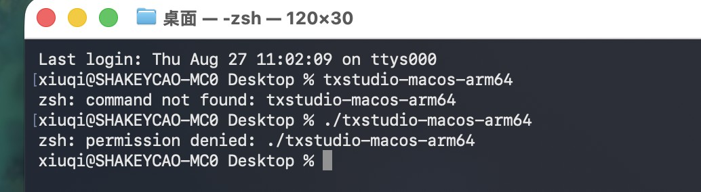
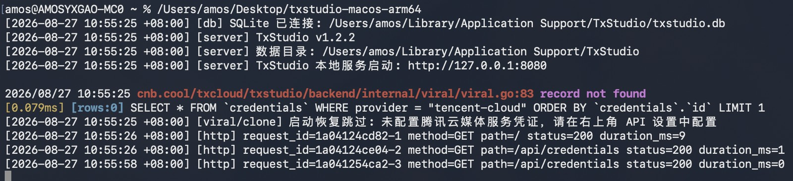
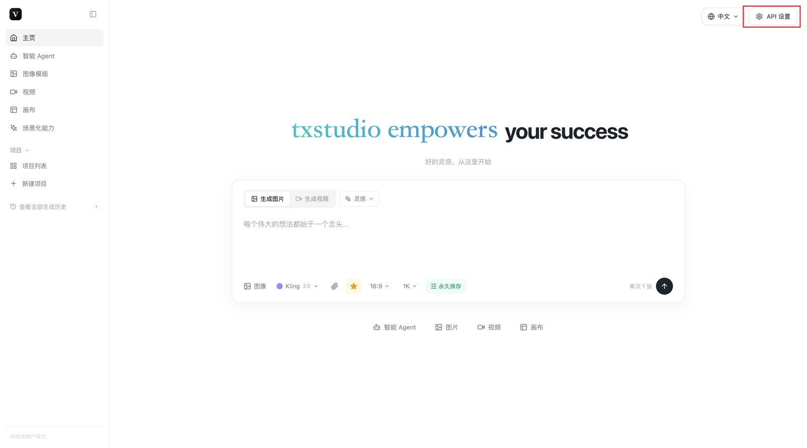
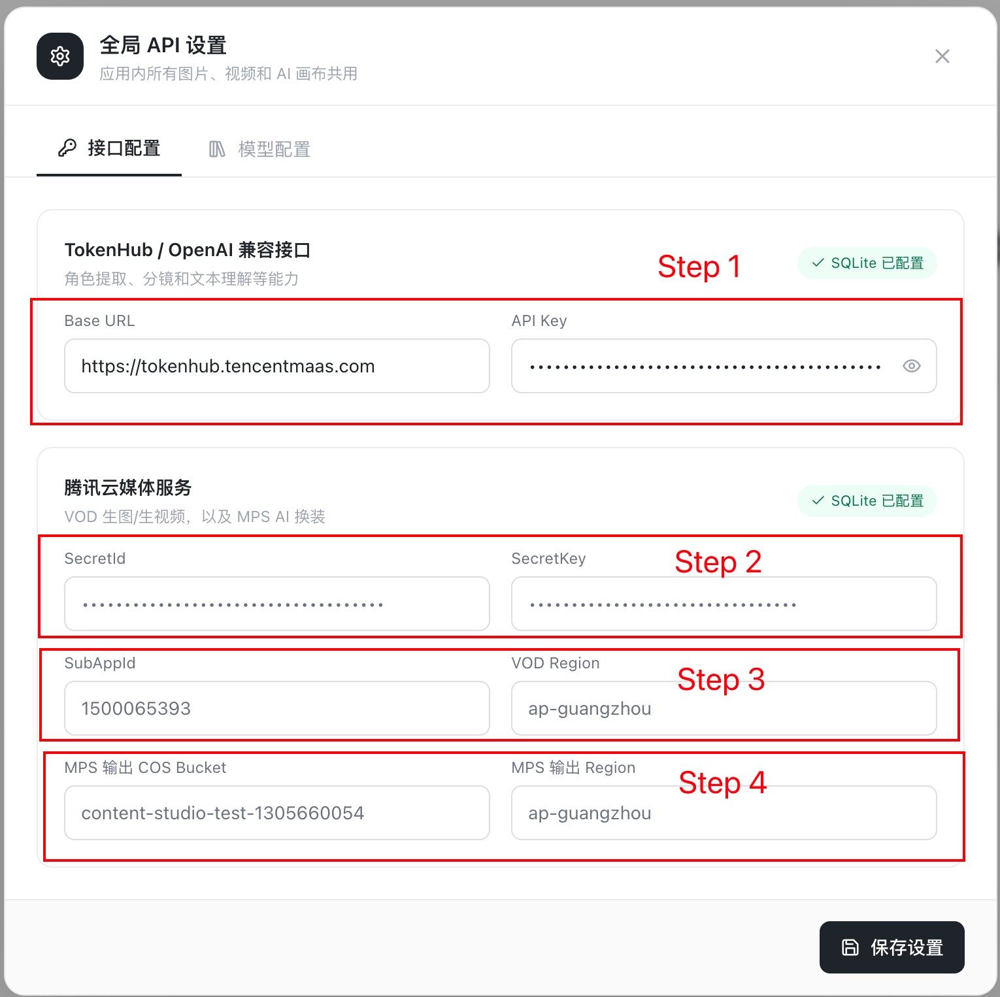
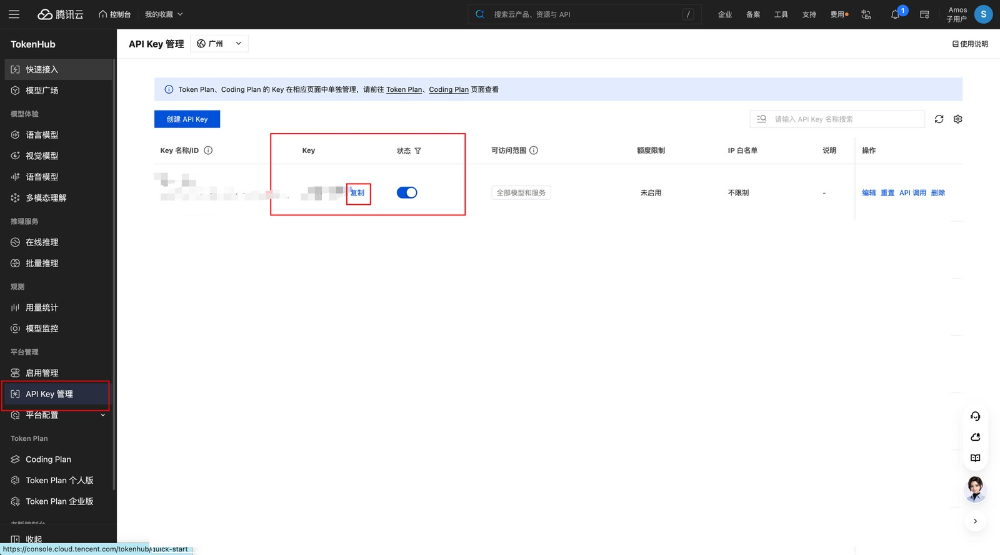
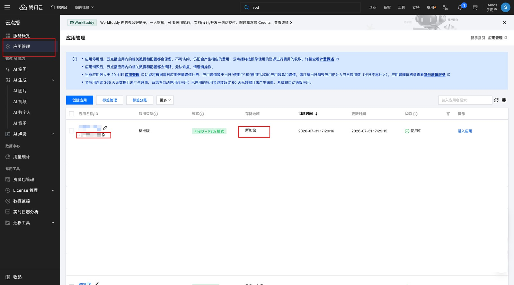
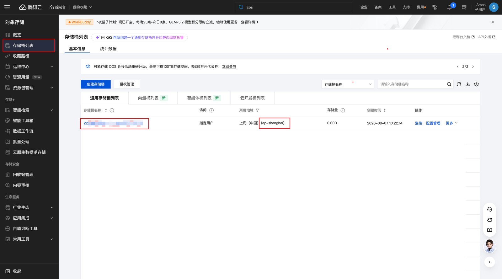

# TxStudio

TxStudio 是一个本地单用户 AI 图片、视频与节点画布工作台。项目由 React/Vite 前端和单一 Go 后端组成；项目、画布过程、生成历史和加密 API 凭证统一保存在本地 SQLite。

## 当前能力

- 图片生成与参考图上传
- 视频生成（首尾帧、多图模式）
- AI 画布：小说输入、角色/场景提取、分镜、生图、生视频、AI 对话
- 场景化能力：电商助手、AI 编辑、画质提升、版权保护
- 腾讯云 MPS AI 换装：模特图 + 服装图、WAND 1.0 模型、1K/2K/4K 输出
- 腾讯云 MPS 图片水印智能擦除：COS 输入转存、文字水印编排 `ScheduleId=30000`
- 腾讯云 MPS 老照片清晰修复：基于公开的超分辨率图像增强能力提升清晰度
- 自定义图像模板：完整生成参数配置、SQLite 持久化、跨浏览器新增/编辑/复制/删除
- 本地项目、完整画布过程和生成历史持久化
- 全局 API 设置：TokenHub/OpenAI 兼容接口、腾讯云 VOD
- 本地缓存与通用 HTTP 代理

## 技术结构

TxStudio 本质是「本地壳 + 腾讯云服务」：前端负责交互，所有云端能力都经本地 Go 后端代签转发，凭证加密存 SQLite，浏览器不接触 SecretKey。

```text
开发期 React/Vite (:5173)
        │ /api + 本地代理接口
        ▼
Go/Gin (:8080)
  ├─ 纯 Go SQLite: 用户数据目录/txstudio.db
  ├─ 加密密钥: 用户数据目录/secret.key
  ├─ 本地缓存: 用户数据目录/cache/
  ├─ VOD TC3 代签
  └─ 发布时完整前端内嵌到单个二进制
```

详细说明见 `docs/ARCHITECTURE.md`。

## 能力清单

各腾讯云服务提供的能力与接入模型：

| 腾讯云服务        | 提供的核心能力                     | 接入的模型                            |
| ------------ | --------------------------- | -------------------------------- |
| **TokenHub** | AI 对话、脚本 / 文案生成、图片理解、视频理解   | 25 个文本 + 5 个多模态                  |
| **云点播 VOD**  | AIGC 生图 / 生视频、视频合成剪辑、语音识别字幕 | 7 类图片 + 8 类视频模型                  |
| **媒体处理 MPS** | 图片智能编排 15 项、爆款复刻、视频译制       | WAND 系列、Gemini-2.5-flash、超分 / 美颜 |
| **对象存储 COS** | 媒资输入 / 输出存储、私有 Bucket 读写    | —（存储底座）                          |

### TokenHub —— LLM 与多模态

**能力**：画布内 AI 对话、分镜脚本 / 剧本生成、文案润色、图片理解（OCR / 图表）、视频理解（描述 / 问答）。

| 类型       | 模型                                                                                                                           |
| -------- | ---------------------------------------------------------------------------------------------------------------------------- |
| 文本（25 个） | 混元 Hy3 / Hy-MT2 / Hy-Role；DeepSeek-V4-Flash / Pro；GLM-5 系列；Kimi K2.5~K3；MiniMax-M2.7 / M3；Qwen3.5-Flash / Plus；MiMo-V2.5-Pro |
| 多模态（5 个） | GLM-5V-Turbo、YT-VITA（图文视频）、HY-Vision-2.0-Instruct、HY-Vision-1.5-Thinking、HY-Vision-Video                                     |

### 云点播 VOD —— AIGC 生成与视频处理

**能力**：文生图 / 图生图（多参考图）、文生视频 / 图生视频（首帧 / 首尾帧 / 多图）、视频合成剪辑（ComposeMedia）、语音全文识别转字幕（ASR：中 / 英 / 日）。

| 类型      | 模型                                                                   |
| ------- | -------------------------------------------------------------------- |
| 图片（7 类） | OG(GPT-Image) / GEM(Gemini) / SI(即梦) / Qwen / Hunyuan / Vidu / Kling |
| 视频（8 类） | Hailuo / Kling / Vidu / GV / OS / Hunyuan / Mingmou / PixVerse       |

### 媒体处理 MPS —— 图片 + 视频智能处理

**图片处理**：一个 `ProcessImage` 接口 + 官方编排号，覆盖 15 项：

| 能力               | 编排                                  |
| ---------------- | ----------------------------------- |
| 智能抠图 / 前景提取      | ScheduleId 30030 / 30031            |
| 老照片修复 / 分镜拆图     | ScheduleId 30040 / 30050            |
| 图片扩图 / 文字水印擦除    | ScheduleId 30010 / 30000            |
| 换模特 / 图片理解       | ScheduleId 30110 / 30200            |
| AI 换装（模特 + 服装）   | AiTryOnConfig                       |
| 电商套图 / 多视角 / 场景图 | AiPosterSuiteConfig                 |
| 背景融合 / 局部重绘      | CreateImageConfig                   |
| 超分辨率 / 综合增强 / 美颜 | EnhanceConfig / BeautyConfig        |
| 盲水印添加·提取 / 压缩    | BlindWatermarkConfig / EncodeConfig |
| 目标检测             | ObjectDetectDescribeConfig          |

**视频处理**：

| 能力   | 实现                                                                                                               |
| ---- | ---------------------------------------------------------------------------------------------------------------- |
| 爆款复刻 | 一体化接口 CloneViral：上传爆款视频 + 商品图，自动完成视频理解拆解 + 生成同款视频（时长 / 比例 / 分辨率 / 裂变档位 / 数字人形象）                                  |
| 视频译制 | 一站式：探测字幕区 → 字幕提取(OCR/ASR) → 翻译 → 原字幕擦除 → 压制译文字幕 → AI 克隆配音（ProcessMedia + AiAnalysisTask Definition=25），支持 32 种语言 |

**模型**：WAND 1.0 / WAND-create-1.0-flash（换装、背景融合、重绘）、WAND-suite-1.0-flash / lite（套图、多视角、场景图）、Google/gemini-2.5-flash（图片理解）、超分 ultra / fidelity、美颜模型（19 项 + 3 滤镜）；爆款复刻与译制的模型由 CloneViral / AiAnalysisTask 编排内置。

## 本地开发

环境要求：Node.js 18+、Go 1.23+。

```bash
npm install
npm run dev
```

`npm run dev` 会同时启动：

- 前端：`http://127.0.0.1:5173`
- 后端：`http://127.0.0.1:8080`

应用为本地单用户模式，无需登录。API 凭证在页面右上角“API 设置”中配置。

## 单二进制发布

构建当前操作系统和 CPU 架构的独立可执行文件：

```bash
npm run build:binary
```

产物只有一个文件：

```text
release/txstudio       # macOS / Linux
release/txstudio.exe   # Windows
```

发布后的二进制已内嵌完整前端，并使用纯 Go SQLite。目标机器运行时不需要安装 Node.js、Go、CGO、SQLite、YAML 配置或其他动态库：

```bash
./txstudio
```

服务默认监听 `127.0.0.1:8080` 并自动打开浏览器。首次运行会在操作系统用户配置目录创建数据库、密钥、缓存和日志：

- macOS：`~/Library/Application Support/TxStudio/`
- Windows：`%AppData%\\TxStudio\\`
- Linux：`$XDG_CONFIG_HOME/TxStudio/` 或 `~/.config/TxStudio/`

运行参数均为可选：

```bash
./txstudio -data-dir ./txstudio-data -port 8080 -open=false
./txstudio -config /path/to/config.yaml
./txstudio -version
```

在空目录和空环境中验证发布文件：

```bash
npm run test:standalone
```

交叉编译时可设置标准 `GOOS`、`GOARCH`，例如：

```bash
GOOS=windows GOARCH=amd64 npm run build:binary
```

不同操作系统和 CPU 架构需要分别构建对应二进制；每个目标的发布内容仍只有一个可执行文件。

`npm run build` 仅构建并同步内嵌前端，供开发调试使用。

## 安装与运行（发布版）

拿到发布二进制后，按以下步骤在本机运行。以 macOS arm64 为例。

### 安装

`txstudio-macos-arm64` 是一个自打包的可执行文件（本地服务，启动后监听 `http://127.0.0.1:8080`），不需要安装程序，只需把文件放到指定目录并赋予执行权限。

**1. 放置文件并赋予执行权限**

```bash
mv txstudio-macos-arm64 /Users/amos/Desktop/   # 放到目标目录（示例为桌面）
cd /Users/amos/Desktop
chmod +x txstudio-macos-arm64                  # 赋予执行权限
```

否则会出现 Permission Denied。



**2. 移除隔离标记（解决「无法验证恶意软件」弹窗）**

```bash
xattr -d com.apple.quarantine txstudio-macos-arm64
```

> 提示：若此步报 `No such xattr: com.apple.quarantine`，说明文件未被标记，忽略即可。

**3.（可选）安装到系统 PATH**

若希望在任何目录直接输入 `txstudio` 启动，可放入系统 PATH：

```bash
sudo mkdir -p /usr/local/bin
sudo mv /Users/amos/Desktop/txstudio-macos-arm64 /usr/local/bin/txstudio
```

### 启动

```bash
cd /Users/amos/Desktop        # 进入文件所在目录（已装 PATH 可跳过）
./txstudio-macos-arm64        # 或已装 PATH 后直接输入 txstudio
```

启动成功的标志：

- 终端出现 `TxStudio v1.2.2` 版本信息
- 显示 `TxStudio 本地服务启动: http://127.0.0.1:8080`
- 启动后保持终端窗口开启，程序在前台运行



**启动常见问题**：

| 报错 / 现象                        | 原因          | 解决办法                                   |
| ------------------------------ | ----------- | -------------------------------------- |
| `zsh: permission denied`       | 缺少执行权限（x 位） | 先执行 `chmod +x 文件名`                     |
| 无法验证…恶意软件                      | 程序带隔离标记（@）  | 执行 `xattr -d com.apple.quarantine 文件名` |
| `bind: address already in use` | 8080 端口被占用  | 查占用进程后停掉（见下方「关闭」）再重启                   |
| 文本编码 UTF-8 不适用                 | 用文本编辑器误打开   | 不要双击，改用终端运行                            |

### 关闭

**正常停止（前台运行）**：在运行 txstudio 的终端窗口中按 `Ctrl + C`；或直接关闭该终端窗口，前台进程会随之结束。

**强制停止（进程卡住 / 后台运行）**：先查占用 8080 端口的进程，再终止：

```bash
lsof -nP -iTCP:8080 -sTCP:LISTEN   # 查到 PID（进程号）
kill -9 <PID>                      # 把 <PID> 换成查到的进程号
```

## API 配置

在 txstudio 主界面点击右上角 **「API 设置」** 按钮：



弹出「全局 API 设置」窗口，应用内所有图片、视频和 AI 画布共用，共 4 步：



| 步骤     | 配置项                                        | 对应控制台                                               |
| ------ | ------------------------------------------ | --------------------------------------------------- |
| Step 1 | TokenHub / OpenAI 兼容接口（Base URL + API Key） | <https://console.cloud.tencent.com/tokenhub/apikey> |
| Step 2 | 腾讯云媒体服务（SecretId + SecretKey）              | <https://console.cloud.tencent.com/cam/capi>        |
| Step 3 | VOD SubAppId + VOD Region                  | <https://console.cloud.tencent.com/vod/app-manage>  |
| Step 4 | MPS 输出 COS Bucket + MPS 输出 Region          | <https://console.cloud.tencent.com/cos/bucket>      |

### Step 1 — TokenHub / OpenAI 兼容接口

进入控制台 → [TokenHub → API Key 管理](https://console.cloud.tencent.com/tokenhub/apikey)，在「平台配置 → API Key 管理」下创建/复制 API Key：



把 Base URL（默认 `https://tokenhub.tencentmaas.com`）和 API Key 填入 Step 1 区域。

### Step 2 — 腾讯云媒体服务（SecretId / SecretKey）

进入控制台 → [访问管理 → 访问密钥 → API 密钥管理](https://console.cloud.tencent.com/cam/capi)，新建/复制一对 SecretId 和 SecretKey，填入 Step 2 区域。

### Step 3 — VOD SubAppId / VOD Region

进入控制台 → [云点播 → 应用管理](https://console.cloud.tencent.com/vod/app-manage)，在应用列表里取「应用 AppID」（即 SubAppId）和「存储地域」对应的 Region：



填入 Step 3 区域（例：`SubAppId=1500065393`，`VOD Region=ap-guangzhou`）。

### Step 4 — MPS 输出 COS Bucket / MPS 输出 Region

进入控制台 → [对象存储 → 存储桶列表](https://console.cloud.tencent.com/cos/bucket)，在桶列表里取「存储桶名称」和「所属地域」对应的 Region：



填入 Step 4 区域（例：`Bucket=content-studio-test-1305660054`，`Region=ap-guangzhou`）。

### 保存

全部 4 步填好后，点击窗口右下角 **「保存设置」**。txstudio 会把配置写入本地 SQLite，后续启动自动加载。

## 数据与安全

- API Secret 使用 AES-256-GCM 加密后写入 SQLite。
- AES 密钥首次启动时自动生成到用户数据目录的 `secret.key`。
- 用户数据目录不属于发布文件，不应提交数据库、密钥、缓存或日志。
- 通用代理拒绝访问环回、私网和未指定地址，降低 SSRF 风险。
- 删除项目会同步硬删除画布快照和生成历史。

## 目录说明

```text
src/                     当前前端源码
backend/                 当前 Go 后端与 SQLite 数据目录
backend/frontend/dist/   Go 内嵌的前端构建产物
docs/                    当前架构说明
assets/images/           文档截图
bak/                     历史参考、旧实现和研究材料，不参与构建运行
```

## 历史归档

`bak/` 中包括旧参考页面、training docs、历史架构图、独立 9527 代理、SaaS 登录/配额代码和已被场景化能力替代的模板库。归档内容仅供追溯，不应被当前源码引用。
